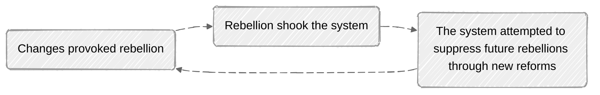
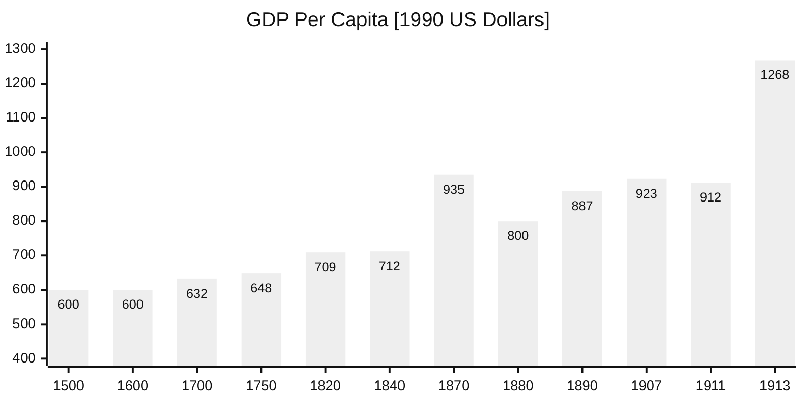
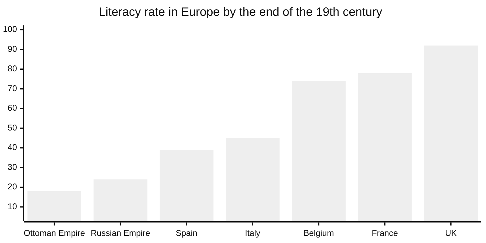
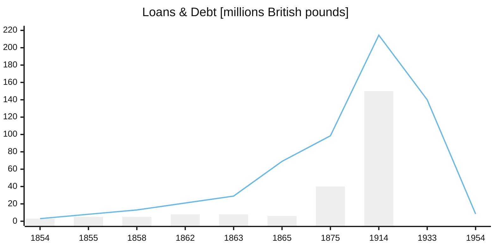

## Beginning of the End

 When meritocracy gives way to nepotism and corruption, the system begins to rot and the decay slowly spreads throughout the entire structure. The pattern is always the same, just with some variations shaped by institutional design and individuals within it.
 
 For Ottomans, it started with the individuals who thought that the system can be misused for their own benefit. Once, the elite forces under the direct sultan's rule, Janissaries started to slowly look like small interest groups, often tied by family connections, whose primary interests were more about their own business than their role in the empire. With the abandonment of strict recruitment process and giving the right to janicarries to marry, two critical problems are created:

 1. Corruption began to dominate recruitment (janissaries were priviledged and had well paid job with close connection to sultan and the court), and 
 2. Their attention diverted from miltary service to family obligations, what in the long run resulted with eroding their eficiency.

All these developments, as a consequence, increased the greed among Janissary troops for more power what led to frequent rebellions and tensions with the sultan. In the end, the empire abandoned its traditional system and sought to establish an army similar to other European empires. However, societies are rarely comfortable with change, and each reform can potentially trigger a new cycle of rebellion. At times, the empire appeared to be spinning in the same circle, trapped in a recurring doom loop. 

 

## Money Scarcity in the State Treasury

With the discovery of alternative maritime routes around Africa, other European powers managed to bypass Ottoman territory and the waters under their control. On the other side, Ottomans failed  to catch the wave of the new world exploration, believing that their position of geopolitical superpower would remain untouched. While Portuguese, British and Spanish explorers sailed across the globe, searching for the new trading routes, the court on Bosphorus enjoyed easy life, thinking it will last forever. Soon after, revenue from tolls and trade duties began to decline due to significantly less traffic through the mainland and the seas controlled by the state.

The discovery of the New World led to massive influx of precious metals into Europe, causing fivefold increase in prices in Istanbul. This resulted in widespreaded inflation that particularly hit the timar system which was relying on fixed income. Inflation made timar system ineffective and contributed to the further decline of spahi ranks. Moreover, changes in the nature of warfare and growing reliance on firearms, reduced the need for cavalry forces, eventualy leading to their final abolition. 

To cover budget deficits, the government frequently lowered the silver content of the Ottoman *akce* (the empire's coined currency), leading to devaluation and soaring prices. This was particulary visible in the late 18th century, when prices increased up to 12 times. Looking at the chart below, which illustrates estimated GDP per capita over time, we can only imagine how these waves of surging inflation affected the daily lives of ordinary people, as GDP per capita only doubled over the entire existence of the empire.

 

## The Erosion of Education and Technological Stagnation

Education and technology are dominant drivers in the adoption of new innovations and societal prosperity overall. For a better understanding of this relationship, let us examine how Ottoman state compared to other European powers in literacy rates by the end of the 19th century.

 During my research, I found it difficult to determine an exact rate for the Ottoman Empire. Estimates range from 5% to 30%. To remain conservative, I used 18%, but even the most optimistic rate of 30% remains remarkably low compared to rates in Britain or France. 
 
 What do these numbers tell us? They suggest that the Ottoman state struggled to understand the new world in which it was living, a world driven by education, knowledge and techological advacement. Why didn't the Industrial Revolution happen in the East? The answer lies in the data above. A society based primarily on agriculture cannot be expected to thrive when their main competitors are producing far more output with significantly less human force. 

## Rivals Newer Sleep

This phrase can be used to describe the entire 19th century for the Ottomans. The state was challenged on every side, while internal problems continued to compound, the economy was declining and inflation was soaring. 

*Vassal states* are refusing to pay taxes, seeking full autonomy. And all this is happening in the very short period of time. The wave of resistance began in the Balkans with the Serbian uprising, followed by Greece, Bulgaria and Bosnia. All these states, driven by rising nationalism, wanted to establish their own states and seeing this as a right time, since the *sick man of the Bosphorus* was increasingly unable to maintain control.

Egypt on the other side became semi-autonomous. Although it was symobolicly ruled by the sultan, it functioned as a de facto independent state. Situation in Egypt was used by Britain and France, making the deal for the Suez Canal with the newly established leadership. Labor force was primarly provided by locals, often through force labor, and under extremely harsh conditions. Approximately 1.5 milion people were working for over ten years on the project which took around 120,000 lives. The estimates vary depending on the source of death; whether it resulted from disease, labor conditions, or weather. 

After ten years of hard work, the canal was opened for use and officially became the property of government in Egypt, but European shareholders owned the company that operated it. Initially, Egypt also held a portion of shares but soon sold it to Britain. In other words, important decisions were made somewhere else, far from Cairo and even further from Istanbul. A strategic geographical location was surrendered with no resistance, resulting in new taxes flowing into someone else’s pockets, while your own state is in desperate need of money.

## The Debt Spiral

Being under constant economic pressure and facing the new war threats, the decision to take a foreign loan appeared in the eyes of the Ottoman court, to be the only way forward. During the Crimean war with Russia, the empire took the first foreign loan and entered into debt spiral. Foreign creditors knew how to use this opportunity to weaken the old rival from the East. The first loan became the entry point into a century long debt slavery. One loan followed another, just to cover the government spending and interests for the previous loans. It was a classic example of the compounding, but this time working against the state. 

Gradually, the empire began to lose its sovereignty. Foreign powers gained the control over financial insitutions, including the establishment and governance of the *Imperial Ottoman Bank*. All the important financial decisions were now made in Paris and London, rather than Istanbul. Once you gave the financial decisions in foreign hands, your chances to influence your own state are very limited. You are the guest in your own house, living in humility and praying for the time to end. When the end finally came, the debt still remained. The Republic of Turkey, as a successor state managed to fully repay the remaining debts inherited from the once mighty empire.

## WWI and Dissolution

The last nail in the coffin of the dying state came with the Great War in Europe. At first, Ottomans attempted to remain neutral. A little bit naive expectation having in mind that all their foreign debt was owed to countries that already took their part in the war. France held 60%, Germany 20% and Britain 15% of Ottoman foreign debt. Siding with Germany, put the Ottomans in the position to settle their debts. They even announce the suspension of foreign debt repayments. 

On the other hand, Germany was already helping Ottomans to industrialize and to modernize their military in the years before war. They also had the idea to build the railway all way to Baghdad and the Persian Gulf, challenging the maritme trade routes controlled by Britain.

Third reason for entering the war was the desire to suppress Russian influence as a neighbor who had pretensions toward Ottoman territory and their raising influence in the Balkans. And, in the end, to try reconquer Balkan states and put them under Ottoman rule once again.

All this didn't go as Central powers imagined. The war ended with big losses on all sides and final victory of Entente. Ottoman Empire lost all of its territories, except the land in Asia minor. In the end, they managed to somehow consolidate their power and to regain control over Istanbul and the territory that we know today as Republic of Turkey. 

With the establishemnt of the republic, all dreams about once-migthy empire were gone. The sultan went into exile, first in Malta, then in Italy. With his removal, the caliphate was also abolished, leaving Muslims officialy without a central leader. This shift would later have profound effects on relations between Arab states and Muslim communities across the world. But that, perhaps, is a topic for another post …

 
 
*I am making this full analysis available to everyone. In the future, these types of essays may become part of paid membership.*  