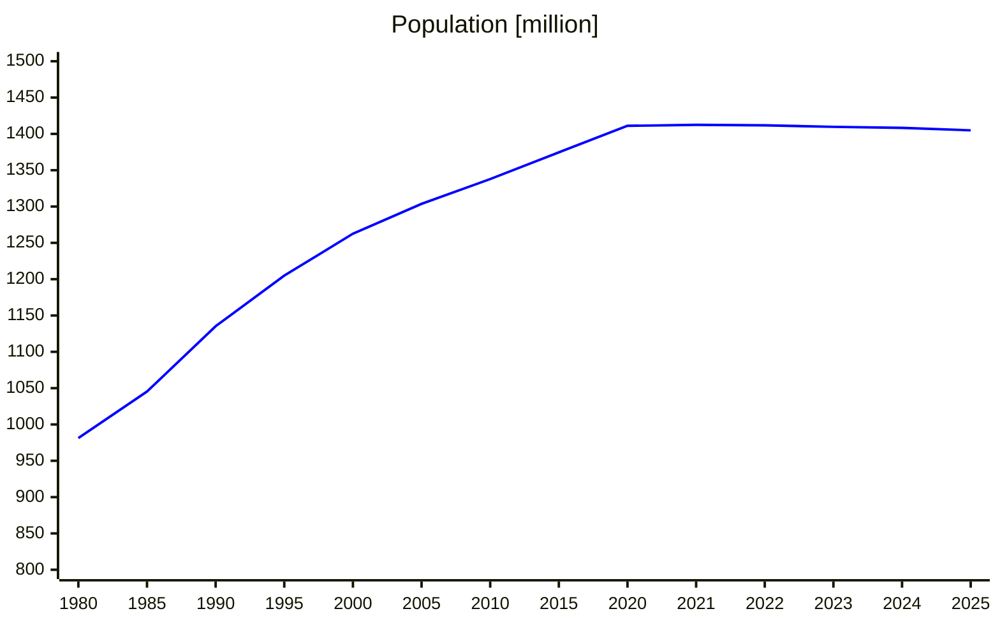
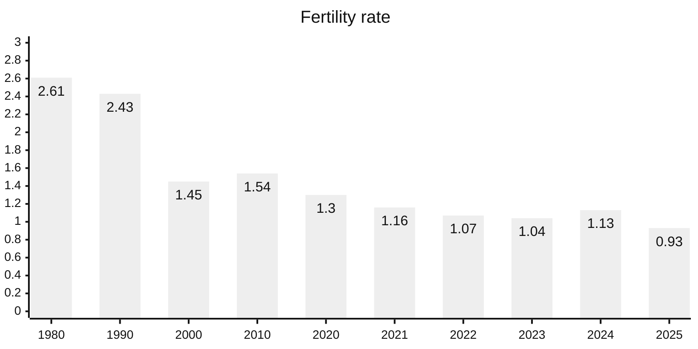
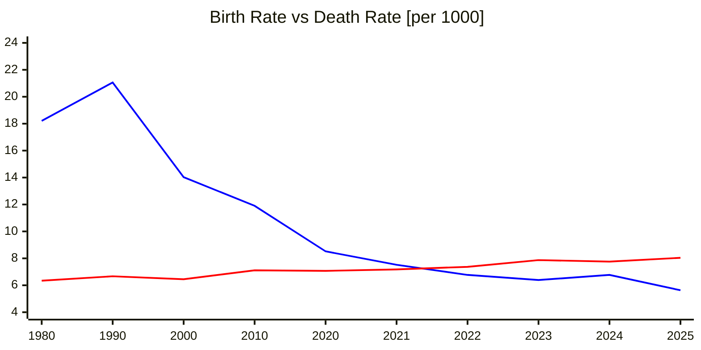
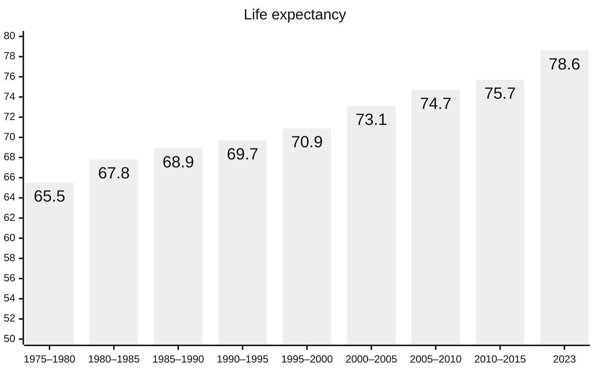

When the Party in the 1979 decided to intervene in the bedrooms of its population by limiting births per couple to only one child in urban areas and up to two children in rural areas,  less was known about the consequences that decision will have decades later. Reasoning lay in planned economy and reducing the population growth due to restricted resources. Once a good plan, later will show its weak spot.

## First Signs

For decades, the world was hearing stories about economic growth from 7% to 10% (sometimes even more), being unrealistic for most western economies. A model that sounded too good to be true, relied on cheap labor force and export oriented economy. Western countries benefited from affordable products while western companies captured massive profits using cheap labor. Everything worked good till it does not.

First signs came in 2020-2021 when the population was on its peak and noticed first decline in decades. 

The change itself didn't bring any disruption immediately, but it was showing the trend where society goes, and later years are showing that the trend will continue for years to come.

## Less Births Despite Policy Abolition

Although the Party formally ended the policy at the beginning of 2016, it didn’t change much inside the population. By that time, the country was already in a period of economic growth for a longer time and facing what many developing nations eventually face. People marry later in life and tend to have less children. This change does not come from ideology or beliefs, but mostly from economic pressure. As incomes rise, so do costs. Housing becomes more expensive, education more competitive, and job security more uncertain. Under such conditions, planning a family, and eventually expanding it, becomes a financial risk rather than a normal choice.

This dynamic is not unique to China. Nearly every developed economy has moved or still moving trough the similar demographic transition.

In the chart above, we see that fertility rate reduced to a third within about four decades. The level required to maintain current population size is about 2.1. China now stands far below that line. At such levels, demographic contraction becomes inevitable. 

The comparison between birth and death rates tells the same story. The crossover point marks the beginning of structural population decline.

## Mechanics of Contraction

Let us imagine two young couples in the 1980s in Beijing, both in their twenties. Life is bright and full of promise. They got married shortly after the Party announced one child policy. One couple has a son, the other has a daughter. They grow up as only children to their parents. Everything seems fine, the families are financially stable, the economy grows, life feels good. 

Later, in the 2010s, the two meet and decide to build a life together. They are already in their thirties, having their parents in their fifties. Being only children, they are the only ones who can care for their parents, who may fall sick or need support. That means the couple is stretched between four older people depending on them. 

At the same time, they are also planning their own family, but now it feels much harder than it did for their parents. Anyways, they are decided to have their own child. New youngster in the family grows up without any close relatives except parents and grandparents. 

Imagine him in his twenties, he has now parents in their fifties, and grandparents in their seventies, and he is the only young adult in the family. He has moral and practical obligations to help his parents and grandparents. On the other side, he wants to start his own family. But the burden is heavy. Costs are high. Responsibilities are pressing. Marriage is postponed. By now, he does not care if the one-child policy is abandoned or not. Children may be delayed... or never come.

## The Pension Burden

When we take a look at the chart below, we can see that life expectancy increased by 13 years over the past five decades. Having in mind that at the beginning of 1980s, when life expectancy was around the same age when people tended to retire, the calculation is simple -> almost no costs for pension fund. Fifty years later, same pension fund now supports people who, on average, remain 13 years on the pay-list.

The charts below show the changing share of the working-age population versus the elderly over recent years. Inevitably, the proportion of elderly is in steadily increase. Since the pension fund operates on a pay-as-you-go basis, this means more and more working individuals must support each retiree. The question is how to maintain this system if trend continues. And looking at the all numbers given, it seems likely that it will. 

<table style="width: 100%">
<tr>
<td>
<pre class="mermaid">
pie title Age Distribution 1970
    "Working Age (15-64)" : 55.5
    "Youth (0-14)" : 40.8
    "Elderly (65+)" : 3.7
</pre>
</td>
<td>
<pre class="mermaid">
pie title Age Distribution 2015
    "Working Age (15-64)" : 73
    "Youth (0-14)" : 16.5
    "Elderly (65+)" : 10.5
</pre>
</td>
</tr>
<tr>
<td>
<pre class="mermaid">
pie title Age Distribution 2020
    "Working Age (15-64)" : 68.6
    "Youth (0-14)" : 17.9
    "Elderly (65+)" : 13.5
</pre>
</td>

<td>
<pre class="mermaid">
pie title Age Distribution 2024
    "Working Age (15-64)" : 69.7
    "Youth (0-14)" : 15.4
    "Elderly (65+)" : 14.9
</pre>
</td>
</tr>
</table>

Older people, on the other hand, naturally tend to develop chronic diseases, require more days in hospitals, and need greater support for medications, elderly care, and other services.

## A Way Forward

China cannot turn time in another direction. The generations that were never born will not suddenly appear, and the structure that was built over decades will not get back overnight. Demographics always move slowly and they cannot turn back quickly.

At the same time, China is investing heavily in the technology, especially robotics and system automation. The goal is clear: to ease labor shortages and increase efficiency. New family policies may not fully reverse the trend, but they can reduce some of the current pressure. 

We can forget GDP growth rates from the past. The system has already expanded enough and is not anymore natural to have such growth rates. At the same time, more companies are shifting their production toward India, Cambodia, Bangladesh, the countries where the labor is still cheaper compared to China. China is not longer the country of cheap labor force.

It will be interesting to see how all of these forces will interact in the years ahead. Whether the country will be able to adapt to its demographic reality or slowly begin to feel the weight of it.

